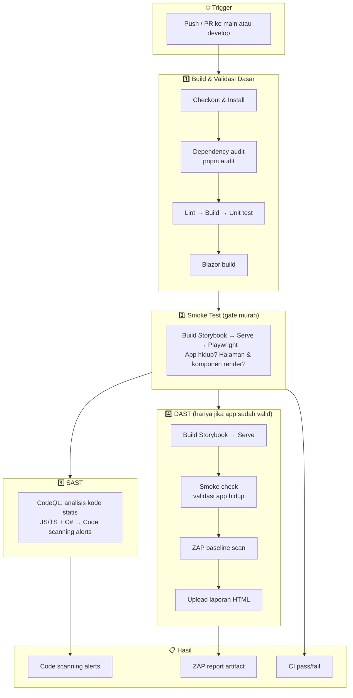

# Langkah-Langkah Penerapan SAST, DAST, dan Smoke Test pada Design System Multi-Framework

Dokumen ini menjelaskan konsep dan langkah penerapan **SAST** (Static Application Security Testing), **DAST** (Dynamic Application Security Testing), dan **Smoke Test** dalam konteks Design System PACER (React, Vue, Blazor) untuk keperluan dokumentasi ilmiah dan operasional.

---

## 1. Pendahuluan

Dalam pengembangan perangkat lunak, pengecekan keamanan dan kualitas dapat dilakukan pada tiga lapisan:

| Jenis Pengecekan | Fase | Objek yang Diperiksa | Contoh Tool |
|------------------|------|----------------------|-------------|
| **SAST** | Sebelum eksekusi (static) | Source code | CodeQL, SonarQube |
| **DAST** | Saat/runtime (dynamic) | Aplikasi yang berjalan | OWASP ZAP |
| **Smoke Test** | Setelah build/deploy | Perilaku dasar aplikasi | Playwright, Cypress |

Ketiganya saling melengkapi: SAST mendeteksi kerentanan di kode sumber, DAST memeriksa aplikasi yang sudah berjalan, dan Smoke Test memastikan fitur kritis tetap berjalan setelah perubahan.

---

## 2. SAST (Static Application Security Testing)

### 2.1 Definisi

**SAST** adalah metode pengujian keamanan yang menganalisis **kode sumber** (source code) tanpa menjalankan aplikasi. Analisis dilakukan terhadap pola kode yang berpotensi rentan (misalnya injeksi, penggunaan data tidak terpercaya, kesalahan konfigurasi).

### 2.2 Karakteristik

- Dilakukan pada **file statis** (`.ts`, `.tsx`, `.vue`, `.cs`, `.razor`, dll.).
- Tidak memerlukan aplikasi dalam keadaan berjalan.
- Dapat diotomasi di pipeline CI (misalnya GitHub Actions).
- Cakupan: seluruh kode yang dianalisis oleh tool (JavaScript/TypeScript untuk React & Vue, C# untuk Blazor).

### 2.3 Tool yang Digunakan: CodeQL

**CodeQL** (GitHub) dipilih karena:

- Gratis untuk repository publik dan penggunaan standar.
- Mendukung multi-bahasa: **JavaScript/TypeScript** (React, Vue) dan **C#** (Blazor) dalam satu monorepo.
- Terintegrasi dengan GitHub Actions dan laporan Code Scanning.

### 2.4 Langkah-Langkah Penerapan SAST dengan CodeQL

1. **Aktivasi Code Scanning**
   - Di repository GitHub: **Settings → Security → Code security and analysis → Code scanning**.
   - Pilih **Set up** untuk CodeQL analysis, lalu pilih **Advanced** agar workflow dapat dikustomisasi.

2. **Workflow GitHub Actions**
   - Buat file `.github/workflows/codeql.yml`.
   - Definisikan trigger (misalnya `push` ke `main`/`develop`, dan `pull_request`).
   - Gunakan **matrix** untuk bahasa: `javascript-typescript` dan `csharp` agar React, Vue, dan Blazor tercakup.

3. **Inisialisasi dan Analisis**
   - **Init:** gunakan action `github/codeql-action/init@v4` dengan `languages: ${{ matrix.language }}`.
   - **Build (jika diperlukan):** untuk C#, jalankan `dotnet build` pada proyek Blazor agar CodeQL dapat menganalisis hasil kompilasi.
   - **Analyze:** gunakan `github/codeql-action/analyze@v4` untuk menjalankan analisis dan mengunggah hasil ke tab Security.

4. **Scope per Framework**
   - **React & Vue:** kode di `packages/design-system/react` dan `packages/design-system/vue` dianalisis sebagai JavaScript/TypeScript.
   - **Blazor:** kode di `packages/design-system/blazor` (`.razor`, `.cs`) dianalisis sebagai C#.

5. **Tindak Lanjut**
   - Periksa alert di **Security → Code scanning alerts**.
   - Perbaiki atau triage (dismiss dengan alasan) agar baseline keamanan tetap terjaga.

---

## 3. DAST (Dynamic Application Security Testing)

### 3.1 Definisi

**DAST** adalah metode pengujian keamanan yang menganalisis aplikasi **saat aplikasi berjalan** (runtime). Tool mengirim permintaan ke endpoint (HTTP/HTTPS) dan menganalisis respons untuk mendeteksi kerentanan (misalnya XSS, miskonfigurasi header, masalah session).

### 3.2 Karakteristik

- Memerlukan **aplikasi yang sudah di-build dan dijalankan** (atau static site yang di-serve).
- Memeriksa perilaku nyata di runtime, bukan hanya kode statis.
- Scope terbatas pada **area yang dapat diakses** (URL yang di-crawl dan di-scan).
- Untuk design system, target umum: **Storybook** (React/Vue) yang di-build lalu di-serve, atau environment staging.

### 3.3 Tool yang Digunakan: OWASP ZAP

**OWASP ZAP** (Zed Attack Proxy) dipilih karena:

- Gratis dan open source.
- Mendukung **baseline scan** yang cocok untuk CI: spider + passive scan, tanpa serangan aktif.
- Dapat dijalankan di GitHub Actions (misalnya dengan action `zaproxy/action-baseline` atau container Docker).

### 3.4 Langkah-Langkah Penerapan DAST dengan OWASP ZAP

1. **Menentukan Target**
   - Target: aplikasi yang akan di-scan (misalnya Storybook React atau Vue yang sudah di-build).
   - Di CI: build Storybook terlebih dahulu, lalu serve hasil build (misalnya dengan `npx serve`) pada port tertentu (misalnya 3000).

2. **Workflow GitHub Actions**
   - Buat workflow (misalnya `.github/workflows/dast-zap.yml`).
   - Langkah:
     - Checkout, setup Node/pnpm.
     - Build Storybook: `pnpm --filter @pacer-ui/storybook-react build` (atau Vue).
     - Jalankan server static di background: `npx serve -s storybook-static -l 3000`.
     - Jalankan ZAP baseline scan terhadap URL target (misalnya `http://localhost:3000` atau `http://host.docker.internal:3000` jika ZAP dijalankan dalam Docker).

3. **Konfigurasi ZAP (Opsional)**
   - File aturan (misalnya `.zap/rules.tsv`) dapat digunakan untuk mengabaikan alert tertentu (false positive) dengan status IGNORE.
   - Parameter seperti `fail_action` dapat diatur agar pipeline tidak gagal hanya karena alert tertentu (misalnya hanya fail pada high/critical).

4. **Scope per Framework**
   - **React:** Storybook React di-build dan di-serve → URL Storybook React menjadi target DAST.
   - **Vue:** Storybook Vue di-build dan di-serve → URL Storybook Vue menjadi target DAST.
   - **Blazor:** Jika ada aplikasi demo/host yang di-deploy, URL-nya dapat ditambahkan sebagai target; jika belum, DAST dapat difokuskan pada React/Vue terlebih dahulu.

5. **Tindak Lanjut**
   - Review laporan ZAP (artifact atau issue yang dibuat action).
   - Perbaiki kerentanan yang valid; untuk false positive, gunakan rules file atau dismiss dengan dokumentasi.

---

## 4. Smoke Test

### 4.1 Definisi

**Smoke Test** adalah pengujian dasar untuk memastikan bahwa **fitur-fitur kritis aplikasi tetap berjalan** setelah build atau deploy. Jika smoke test gagal, build dianggap tidak layak untuk pengujian lebih lanjut.

### 4.2 Karakteristik

- Cakupan **sempit** dan **cepat**: fokus pada alur utama (misalnya halaman bisa dibuka, komponen utama ter-render).
- Dilakukan setelah build (biasanya otomatis di CI).
- Dapat menggunakan **E2E** (End-to-End) dengan browser otomatis (misalnya Playwright).

### 4.3 Tool yang Digunakan: Playwright

**Playwright** dipilih karena:

- Gratis dan open source.
- Mendukung multi-browser (Chromium, Firefox, WebKit).
- Cocok untuk otomasi CI: headless, stabil, dan mendukung beberapa project (misalnya React Storybook dan Vue Storybook dalam satu konfigurasi).

### 4.4 Langkah-Langkah Penerapan Smoke Test dengan Playwright

1. **Persiapan**
   - Tambahkan dependensi: `@playwright/test` di root monorepo (atau di package yang menampung e2e).
   - Buat konfigurasi `playwright.config.ts` (root atau folder e2e).

2. **Konfigurasi Proyek**
   - Definisikan **beberapa project** jika ada beberapa target (misalnya `react-storybook`, `vue-storybook`).
   - Untuk masing-masing project, atur **webServer** yang menjalankan build Storybook (misalnya `npx serve -s packages/storybook/react/storybook-static -p 6006`) agar CI tidak perlu menjalankan server secara manual di step terpisah, atau gunakan build + serve yang sudah ada di workflow.

3. **Skrip Smoke Test**
   - Buat test minimal, misalnya:
     - Buka URL index Storybook.
     - Pastikan halaman ter-load (misalnya `expect(title).toContain(...)` atau pengecekan elemen utama).
     - (Opsional) Klik satu komponen atau navigasi sederhana.
   - Simpan di folder seperti `e2e/smoke/` atau `tests/smoke/`.

4. **Integrasi ke CI**
   - Di workflow CI (misalnya `.github/workflows/ci.yml`):
     - Setelah build Storybook React dan Vue, jalankan `pnpm exec playwright install --with-deps chromium` (atau browser yang dipilih).
     - Jalankan `pnpm run test:smoke` (yang memanggil `playwright test`).

5. **Scope per Framework**
   - **React:** Smoke test terhadap Storybook React (build → serve → buka URL → assert).
   - **Vue:** Smoke test terhadap Storybook Vue (build → serve → buka URL → assert).
   - **Blazor:** Smoke test dapat berupa build proyek Blazor (`dotnet build`) untuk memastikan tidak ada error kompilasi; jika ada aplikasi host/demo yang di-serve, dapat ditambah skrip Playwright untuk membuka halaman utama.

### 4.5 Penting: Storybook Static Serve dan URL Preview

Smoke test membuka **URL preview langsung** (bukan halaman manager), yaitu `/iframe.html?viewMode=story&id=<storyId>`. Dengan begitu test tidak bergantung pada halaman manager atau elemen iframe `#storybook-preview-iframe`. Jika server static (misalnya `serve`) melakukan **redirect 301** dari `/iframe.html?...` ke `/iframe` **tanpa mempertahankan query string**, halaman preview akan load tanpa `id` cerita sehingga **preview kosong** dan test gagal (element seperti tombol "Primary Action" tidak ditemukan).

**Solusi yang diterapkan:**

- **`serve.json` dengan `cleanUrls: false`**  
  File `packages/storybook/react/serve.json` dan `packages/storybook/vue/serve.json` berisi `{ "cleanUrls": false }`. Ini mencegah redirect yang membuang query string.
- **Copy setelah build**  
  Script `build` di package Storybook React/Vue menyalin `serve.json` ke `storybook-static/` setelah `storybook build`. **Wajib jalankan build ulang** sebelum serve agar `storybook-static/serve.json` ada; tanpa itu smoke test akan gagal.
- **Pastikan Storybook sudah di-build sebelum serve**  
  Di CI, langkah "Build Storybook (React & Vue)" dijalankan sebelum serve dan Playwright. Secara lokal: `pnpm --filter @pacer-ui/storybook-react build` (dan Vue) lalu `pnpm exec serve packages/storybook/react/storybook-static -l 6006`.

**Jika test masih gagal (element tidak ditemukan):**

- Pastikan **build Storybook baru** telah dijalankan (agar `storybook-static/serve.json` tercopy), lalu serve dan jalankan Playwright.
- Pastikan server Storybook sudah up di `http://127.0.0.1:6006` (atau 6007 untuk Vue) sebelum test dijalankan.
- Pastikan story ID dan teks tombol di story (misalnya "Primary Action", "Solid Button", "Close") sesuai dengan query di `e2e/smoke/storybook-react.spec.ts` (atau storybook-vue). Jika label di story berubah, sesuaikan test atau story.
- Jika CI lambat, pertimbangkan menaikkan timeout di `toBeVisible({ timeout: 25_000 })`.

---

## 5. Diagram Alur Security (Pertama hingga Akhir)

**Konsensus (paper + praktisi senior):** Smoke test **harus** sebelum DAST, dan biasanya sebelum SAST berat. Urutan yang benar:

**Build → Smoke Test → SAST → DAST**

Bukan: SAST/DAST dulu baru Smoke Test.

### 5.1 Kenapa urutan ini?

| Alasan | Penjelasan |
|--------|------------|
| **DAST butuh aplikasi hidup** | ZAP/Burp/OWASP scanner butuh endpoint aktif. Kalau app gagal start, config error, atau port tidak kebuka → DAST error, hasil invalid, waktu CI terbuang. **Rule keras: never scan a dead app.** |
| **Smoke test = gate paling murah** | Smoke (start app, hit homepage/preview): detik–menit. SAST/DAST: menit–puluhan menit. Secara ekonomi engineering: cek yang paling murah dulu. |
| **False positive explosion** | Kalau app gagal start atau dependency missing, SAST/DAST bisa laporkan error aneh, noise tinggi, hasil sulit dipercaya. Senior engineer menghindari pipeline yang noisy. |
| **Paper & industry** | Model seperti Google Testing Pyramid, Microsoft SDL, OWASP SAMM menempatkan **basic validation** dulu, baru security scanning. |

### 5.2 Diagram urutan yang benar

**Ringkas:** Build dulu, lalu smoke test sebagai gate; baru setelah itu SAST dan DAST. DAST selalu didahului smoke check (di workflow DAST: serve → smoke check → ZAP).

### 5.3 Urutan cek di dalam CI (ci.yml)

| No | Cek | Tool / Aksi | Yang dicek |
|----|-----|-------------|------------|
| 1 | Dependency vulnerability | `pnpm audit` | Dependency high/critical |
| 2 | Lint | ESLint | Kode JS/TS/Vue |
| 3 | Build | Turbo (Vite, tsc, dll.) | Compile & bundle |
| 4 | Unit test | Vitest | React & Vue tests |
| 5 | Blazor build | dotnet build | Kode C#/Razor |
| 6 | **Smoke test** | Playwright | Storybook hidup & render (gate sebelum security scan berat) |

### 5.4 SAST & DAST (setelah konsep “app valid”)

| Workflow | Urutan di dalam workflow | Hasil |
|----------|--------------------------|--------|
| **CodeQL** | Build → Analyze | Security → Code scanning alerts |
| **DAST ZAP** | Build → Serve → **Smoke check** → ZAP scan | Artifact laporan HTML (ZAP hanya jalan kalau smoke check lulus) |

---

## 6. Ringkasan Alur di CI Pipeline

**Urutan yang diterapkan (konsisten dengan konsensus): Build → Smoke Test → SAST → DAST.**

1. **Checkout & Install**  
   Checkout kode, install dependensi (pnpm), dan jalankan **pnpm audit** (dependency check).

2. **Lint & Build**  
   Lint (ESLint), build (Turbo: tokens, tailwind, React, Vue, Storybook), dan unit test (Vitest untuk React/Vue).

3. **Blazor Build**  
   Restore dan build proyek Blazor (`dotnet build`) untuk memastikan kode C#/Razor valid.

4. **Smoke Test (Playwright)**  
   Build Storybook React & Vue, install browser Playwright, jalankan smoke test terhadap Storybook yang di-serve. **Gate murah sebelum security scan berat;** memastikan app hidup dan render.

5. **SAST (CodeQL)**  
   Workflow terpisah: **`.github/workflows/codeql.yml`**. Inisialisasi CodeQL untuk JavaScript/TypeScript dan C# (matrix), analisis, unggah hasil ke **GitHub → Security → Code scanning alerts**. Dijalankan setelah konsep “build & validasi dasar” (smoke di CI memvalidasi app yang di-build di CI).

6. **DAST (OWASP ZAP)**  
   Workflow terpisah: **`.github/workflows/dast-zap.yml`**. Urutan di dalam workflow: Build Storybook → Serve → **Smoke check** (validasi app hidup & preview load) → baru ZAP baseline scan. **Never scan a dead app:** ZAP hanya dijalankan jika smoke check lulus. Laporan HTML diunggah sebagai artifact (**zap-baseline-report**).

Dengan demikian, smoke test menjadi gate sebelum SAST/DAST; SAST memeriksa kode statis (React, Vue, Blazor), DAST memeriksa aplikasi yang berjalan (Storybook) hanya setelah app divalidasi hidup.

---

## 7. Alternatif Gratis: SAST, DAST, OWASP (Tanpa CodeQL / Tanpa Code Scanning)

**CodeQL** gratis untuk repo **publik** GitHub. Untuk repo **privat** ada batas (mis. 1x per minggu per repo pada tier gratis). Selain itu, hasil CodeQL hanya muncul di **Security → Code scanning**, yang harus **diaktifkan** di Settings repo.

Berikut cara tetap dapat **hasil SAST dan DAST** (dan konteks OWASP) tanpa bergantung pada CodeQL atau fitur berbayar:

### 7.1 Hasil SAST (tanpa CodeQL)

| Tool | Gratis? | Cara dapat hasil | Catatan |
|------|--------|-------------------|--------|
| **Semgrep** (Community / CLI) | Ya (open source, LGPL) | Artifact JSON/SARIF di GitHub Actions, atau job summary | Tidak perlu token; jalankan `semgrep scan --config auto` di CI. Workflow contoh: `.github/workflows/semgrep.yml`. |
| **Trivy** | Ya | Artifact / job summary / SARIF | Scan kode + dependency. `trivy fs . --format json`. |
| **ESLint** + `eslint-plugin-security` | Ya | Output lint di log CI, atau artifact | Sudah ada di pipeline (lint); bisa tambah rule keamanan. |
| **SonarQube** (Community Edition) | Ya (self-hosted) | Dashboard SonarQube sendiri | Perlu deploy server; integrasi CI dengan SonarScanner. |
| **CodeQL** | Gratis (repo publik); terbatas (repo privat) | Security → Code scanning (harus diaktifkan) | Butuh “Code scanning” enabled di repo. |

**Rekomendasi:** Jika tidak pakai CodeQL atau Code scanning tidak diaktifkan, gunakan **Semgrep** di CI dan simpan hasil sebagai **artifact** (JSON/SARIF) atau tampilkan di **job summary**. Itu sumber “informasi hasil SAST” yang gratis.

### 7.2 Hasil DAST (sudah gratis)

| Tool | Gratis? | Cara dapat hasil |
|------|--------|-------------------|
| **OWASP ZAP** (baseline scan) | Ya | Artifact laporan HTML di GitHub Actions (**zap-baseline-report**). Workflow: `.github/workflows/dast-zap.yml`. |

DAST tidak bergantung pada CodeQL; hasil ZAP bisa selalu diambil dari artifact setelah job DAST selesai.

### 7.3 OWASP dan “WASP”

- **OWASP** = Open Web Application Security Project. Banyak tool keamanan (ZAP, Dependency-Check, dll.) dari ekosistem OWASP.
- **ZAP** = DAST dari OWASP (sudah dipakai di repo ini).
- **Dependency-Check** (OWASP) = scan dependency; mirip `pnpm audit` (yang sudah ada di CI).
- Jika yang dimaksud “WASP” = **OWASP**, maka informasi SAST + DAST + OWASP bisa didapat dari: Semgrep (SAST) + ZAP (DAST) + dokumentasi OWASP / daftar tool OWASP.

### 7.4 Ringkas: di mana lihat hasil?

| Jenis | Sumber hasil (gratis) |
|-------|------------------------|
| **SAST** | Artifact workflow Semgrep (mis. `semgrep-results.sarif` / JSON), atau log CI Trivy/ESLint. Jika pakai CodeQL + Code scanning: Security → Code scanning. |
| **DAST** | Artifact **zap-baseline-report** (HTML) dari job DAST ZAP. |
| **Dependency** | Log CI `pnpm audit`; atau artifact dari Trivy / OWASP Dependency-Check. |

Workflow **Semgrep** (`.github/workflows/semgrep.yml`) ditambahkan sebagai opsi SAST yang tidak memerlukan CodeQL maupun aktivasi Code scanning.

---

## 8. Referensi

- [GitHub CodeQL](https://codeql.github.com/)
- [GitHub: Configuring advanced setup for code scanning](https://docs.github.com/en/code-security/code-scanning/creating-an-advanced-setup-for-code-scanning/configuring-advanced-setup-for-code-scanning)
- [Semgrep](https://semgrep.dev/) — SAST gratis (CE), rule auto, output JSON/SARIF
- [Semgrep: Add to CI](https://semgrep.dev/docs/deployment/add-semgrep-to-ci)
- [OWASP ZAP Baseline Scan](https://www.zaproxy.org/docs/docker/baseline-scan/)
- [zaproxy/action-baseline](https://github.com/zaproxy/action-baseline)
- [Playwright Documentation](https://playwright.dev/docs/intro)

---

*Dokumen ini dapat dikutip atau disesuaikan untuk keperluan lembar ilmiah dengan menyebutkan sumber (repository Design System PACER dan dokumen ini).*
