# Langkah-Langkah Penerapan SAST, DAST, dan Smoke Test pada Design System Multi-Framework

Dokumen ini menjelaskan konsep dan langkah penerapan **SAST** (Static Application Security Testing), **DAST** (Dynamic Application Security Testing), dan **Smoke Test** dalam konteks Design System PACER (React, Vue, Blazor) untuk keperluan dokumentasi ilmiah dan operasional.

---

## 1. Pendahuluan

Dalam pengembangan perangkat lunak, pengecekan keamanan dan kualitas dapat dilakukan pada tiga lapisan:

| Jenis Pengecekan | Fase | Objek yang Diperiksa | Contoh Tool |
|------------------|------|----------------------|-------------|
| **SAST** | Sebelum eksekusi (static) | Source code | Semgrep, SonarQube |
| **DAST** | Saat/runtime (dynamic) | Aplikasi yang berjalan | OWASP ZAP |
| **Smoke Test** | Setelah build/deploy | Perilaku dasar aplikasi | Playwright, Cypress |

Ketiganya saling melengkapi: SAST mendeteksi kerentanan di kode sumber, DAST memeriksa aplikasi yang sudah berjalan, dan Smoke Test memastikan fitur kritis tetap berjalan setelah perubahan.

---

## 2. SAST (Static Application Security Testing)

### 2.1 Definisi

**SAST** adalah metode pengujian keamanan yang menganalisis **kode sumber** (source code) tanpa menjalankan aplikasi. Analisis dilakukan terhadap pola kode yang berpotensi rentan (misalnya injeksi, penggunaan data tidak terpercaya, kesalahan konfigurasi).

### 2.2 Karakteristik

- Dilakukan pada **file statis** (`.ts`, `.tsx`, `.vue`, `.cs`, `.razor`, dll.).
- Tidak memerlukan aplikasi dalam keadaan berjalan.
- Dapat diotomasi di pipeline CI (misalnya GitHub Actions).
- Cakupan: seluruh kode yang dianalisis oleh tool (JavaScript/TypeScript untuk React & Vue, C# untuk Blazor).

### 2.3 Tool yang Digunakan: Semgrep

**Semgrep** (Community Edition) dipilih karena:

- Gratis, open source (LGPL); tidak perlu Code scanning atau token.
- Mendukung **JavaScript/TypeScript** (React, Vue); rule `--config auto` dari Registry.
- Dijalankan dalam satu workflow CI (job **sast-semgrep**); hasil ke artifact JSON.

### 2.4 Langkah-Langkah Penerapan SAST dengan Semgrep (dalam ci.yml)

1. **Satu workflow**
   - Semua dalam **`.github/workflows/ci.yml`**. Tidak ada workflow terpisah untuk SAST.

2. **Urutan job**
   - **lint-build-test** (CI) → **smoke-playwright** (Smoke test) → **sast-semgrep** (SAST) → **dast-zap** (DAST, `needs: [smoke-playwright, sast-semgrep]`). Jika CI, smoke, atau SAST gagal, DAST tidak jalan.

3. **Job sast-semgrep**
   - `needs: smoke-playwright`. Checkout, lalu `docker run semgrep/semgrep semgrep scan --config p/javascript --config p/typescript --config p/vue --metrics=off --json --json-output=semgrep-results.json` (config eksplisit karena `--config auto` tidak bisa dipakai dengan `--metrics=off`).
   - Upload artifact **semgrep-results** (retensi 30 hari).

4. **Scope**
   - Kode di repo (React, Vue, JS/TS) dianalisis oleh rule auto Semgrep. Blazor (C#) tidak di-scan oleh Semgrep di set-up ini; bila perlu bisa ditambah job terpisah atau tool lain.

5. **Tindak Lanjut**
   - Unduh artifact **semgrep-results** dari run GitHub Actions; periksa findings di file JSON. Perbaiki atau triage sesuai kebijakan tim.

---

## 3. DAST (Dynamic Application Security Testing)

### 3.1 Definisi

**DAST** adalah metode pengujian keamanan yang menganalisis aplikasi **saat aplikasi berjalan** (runtime). Tool mengirim permintaan ke endpoint (HTTP/HTTPS) dan menganalisis respons untuk mendeteksi kerentanan (misalnya XSS, miskonfigurasi header, masalah session).

### 3.2 Karakteristik

- Memerlukan **aplikasi yang sudah di-build dan dijalankan** (atau static site yang di-serve).
- Memeriksa perilaku nyata di runtime, bukan hanya kode statis.
- Scope terbatas pada **area yang dapat diakses** (URL yang di-crawl dan di-scan).
- Untuk design system, target umum: **Storybook** (React/Vue) yang di-build lalu di-serve, atau environment staging.

### 3.3 Tool yang Digunakan: OWASP ZAP

**OWASP ZAP** (Zed Attack Proxy) dipilih karena:

- Gratis dan open source.
- Mendukung **baseline scan** yang cocok untuk CI: spider + passive scan, tanpa serangan aktif.
- Dapat dijalankan di GitHub Actions (misalnya dengan action `zaproxy/action-baseline` atau container Docker).

### 3.4 Langkah-Langkah Penerapan DAST dengan OWASP ZAP

1. **Menentukan Target**
   - Target: aplikasi yang akan di-scan (misalnya Storybook React atau Vue yang sudah di-build).
   - Di CI: build Storybook terlebih dahulu, lalu serve hasil build (misalnya dengan `npx serve`) pada port tertentu (misalnya 3000).

2. **Workflow GitHub Actions**
   - Buat workflow (misalnya `.github/workflows/dast-zap.yml`).
   - Langkah:
     - Checkout, setup Node/pnpm.
     - Build Storybook: `pnpm --filter @pacer-ui/storybook-react build` (atau Vue).
     - Jalankan server static di background: `npx serve -s storybook-static -l 3000`.
     - Jalankan ZAP baseline scan terhadap URL target (misalnya `http://localhost:3000` atau `http://host.docker.internal:3000` jika ZAP dijalankan dalam Docker).

3. **Konfigurasi ZAP (Opsional)**
   - File aturan (misalnya `.zap/rules.tsv`) dapat digunakan untuk mengabaikan alert tertentu (false positive) dengan status IGNORE.
   - Parameter seperti `fail_action` dapat diatur agar pipeline tidak gagal hanya karena alert tertentu (misalnya hanya fail pada high/critical).

4. **Scope per Framework**
   - **React:** Storybook React di-build dan di-serve → URL Storybook React menjadi target DAST.
   - **Vue:** Storybook Vue di-build dan di-serve → URL Storybook Vue menjadi target DAST.
   - **Blazor:** Jika ada aplikasi demo/host yang di-deploy, URL-nya dapat ditambahkan sebagai target; jika belum, DAST dapat difokuskan pada React/Vue terlebih dahulu.

5. **Tindak Lanjut**
   - Review laporan ZAP (artifact atau issue yang dibuat action).
   - Perbaiki kerentanan yang valid; untuk false positive, gunakan rules file atau dismiss dengan dokumentasi.

---

## 4. Smoke Test

### 4.1 Definisi

**Smoke Test** adalah pengujian dasar untuk memastikan bahwa **fitur-fitur kritis aplikasi tetap berjalan** setelah build atau deploy. Jika smoke test gagal, build dianggap tidak layak untuk pengujian lebih lanjut.

### 4.2 Karakteristik

- Cakupan **sempit** dan **cepat**: fokus pada alur utama (misalnya halaman bisa dibuka, komponen utama ter-render).
- Dilakukan setelah build (biasanya otomatis di CI).
- Dapat menggunakan **E2E** (End-to-End) dengan browser otomatis (misalnya Playwright).

### 4.3 Tool yang Digunakan: Playwright

**Playwright** dipilih karena:

- Gratis dan open source.
- Mendukung multi-browser (Chromium, Firefox, WebKit).
- Cocok untuk otomasi CI: headless, stabil, dan mendukung beberapa project (misalnya React Storybook dan Vue Storybook dalam satu konfigurasi).

### 4.4 Langkah-Langkah Penerapan Smoke Test dengan Playwright

1. **Persiapan**
   - Tambahkan dependensi: `@playwright/test` di root monorepo (atau di package yang menampung e2e).
   - Buat konfigurasi `playwright.config.ts` (root atau folder e2e).

2. **Konfigurasi Proyek**
   - Definisikan **beberapa project** jika ada beberapa target (misalnya `react-storybook`, `vue-storybook`).
   - Untuk masing-masing project, atur **webServer** yang menjalankan build Storybook (misalnya `npx serve -s packages/storybook/react/storybook-static -p 6006`) agar CI tidak perlu menjalankan server secara manual di step terpisah, atau gunakan build + serve yang sudah ada di workflow.

3. **Skrip Smoke Test**
   - Buat test minimal, misalnya:
     - Buka URL index Storybook.
     - Pastikan halaman ter-load (misalnya `expect(title).toContain(...)` atau pengecekan elemen utama).
     - (Opsional) Klik satu komponen atau navigasi sederhana.
   - Simpan di folder seperti `e2e/smoke/` atau `tests/smoke/`.

4. **Integrasi ke CI**
   - Di workflow CI (misalnya `.github/workflows/ci.yml`):
     - Setelah build Storybook React dan Vue, jalankan `pnpm exec playwright install --with-deps chromium` (atau browser yang dipilih).
     - Jalankan `pnpm run test:smoke` (yang memanggil `playwright test`).

5. **Scope per Framework**
   - **React:** Smoke test terhadap Storybook React (build → serve → buka URL → assert).
   - **Vue:** Smoke test terhadap Storybook Vue (build → serve → buka URL → assert).
   - **Blazor:** Smoke test dapat berupa build proyek Blazor (`dotnet build`) untuk memastikan tidak ada error kompilasi; jika ada aplikasi host/demo yang di-serve, dapat ditambah skrip Playwright untuk membuka halaman utama.

### 4.5 Penting: Storybook Static Serve dan URL Preview

Smoke test membuka **URL preview langsung** (bukan halaman manager), yaitu `/iframe.html?viewMode=story&id=<storyId>`. Dengan begitu test tidak bergantung pada halaman manager atau elemen iframe `#storybook-preview-iframe`. Jika server static (misalnya `serve`) melakukan **redirect 301** dari `/iframe.html?...` ke `/iframe` **tanpa mempertahankan query string**, halaman preview akan load tanpa `id` cerita sehingga **preview kosong** dan test gagal (element seperti tombol "Primary Action" tidak ditemukan).

**Solusi yang diterapkan:**

- **`serve.json` dengan `cleanUrls: false`**  
  File `packages/storybook/react/serve.json` dan `packages/storybook/vue/serve.json` berisi `{ "cleanUrls": false }`. Ini mencegah redirect yang membuang query string.
- **Copy setelah build**  
  Script `build` di package Storybook React/Vue menyalin `serve.json` ke `storybook-static/` setelah `storybook build`. **Wajib jalankan build ulang** sebelum serve agar `storybook-static/serve.json` ada; tanpa itu smoke test akan gagal.
- **Pastikan Storybook sudah di-build sebelum serve**  
  Di CI, langkah "Build Storybook (React & Vue)" dijalankan sebelum serve dan Playwright. Secara lokal: `pnpm --filter @pacer-ui/storybook-react build` (dan Vue) lalu `pnpm exec serve packages/storybook/react/storybook-static -l 6006`.

**Jika test masih gagal (element tidak ditemukan):**

- Pastikan **build Storybook baru** telah dijalankan (agar `storybook-static/serve.json` tercopy), lalu serve dan jalankan Playwright.
- Pastikan server Storybook sudah up di `http://127.0.0.1:6006` (atau 6007 untuk Vue) sebelum test dijalankan.
- Pastikan story ID dan teks tombol di story (misalnya "Primary Action", "Solid Button", "Close") sesuai dengan query di `e2e/smoke/storybook-react.spec.ts` (atau storybook-vue). Jika label di story berubah, sesuaikan test atau story.
- Jika CI lambat, pertimbangkan menaikkan timeout di `toBeVisible({ timeout: 25_000 })`.

---

## 5. Diagram Alur Security (Pertama hingga Akhir)

**Konsensus (paper + praktisi senior):** Smoke test **harus** sebelum DAST, dan biasanya sebelum SAST berat. Urutan yang benar:

**Build → Smoke Test → SAST → DAST**

Bukan: SAST/DAST dulu baru Smoke Test.

### 5.1 Kenapa urutan ini?

| Alasan | Penjelasan |
|--------|------------|
| **DAST butuh aplikasi hidup** | ZAP/Burp/OWASP scanner butuh endpoint aktif. Kalau app gagal start, config error, atau port tidak kebuka → DAST error, hasil invalid, waktu CI terbuang. **Rule keras: never scan a dead app.** |
| **Smoke test = gate paling murah** | Smoke (start app, hit homepage/preview): detik–menit. SAST/DAST: menit–puluhan menit. Secara ekonomi engineering: cek yang paling murah dulu. |
| **False positive explosion** | Kalau app gagal start atau dependency missing, SAST/DAST bisa laporkan error aneh, noise tinggi, hasil sulit dipercaya. Senior engineer menghindari pipeline yang noisy. |
| **Paper & industry** | Model seperti Google Testing Pyramid, Microsoft SDL, OWASP SAMM menempatkan **basic validation** dulu, baru security scanning. |

### 5.2 Diagram urutan yang benar

```mermaid
flowchart TB
  subgraph trigger["⏱ Trigger"]
    T[Push / PR ke main atau develop]
  end

  subgraph phase1["1️⃣ Build & Validasi Dasar"]
    direction TB
    B1[Checkout & Install]
    B2[Dependency audit<br/>pnpm audit]
    B3[Lint → Build → Unit test]
    B4[Blazor build]
    B1 --> B2 --> B3 --> B4
  end

  subgraph phase2["2️⃣ Smoke Test (gate murah)"]
    SM[Build Storybook → Serve → Playwright<br/>App hidup? Halaman & komponen render?]
  end

  subgraph phase3["3️⃣ SAST (hanya jika CI lulus)"]
    SAST[Semgrep: analisis kode statis<br/>→ artifact semgrep-results.json]
  end

  subgraph phase4["4️⃣ DAST (hanya jika SAST job selesai)"]
    direction TB
    D1[Build Storybook → Serve]
    D2[Smoke check<br/>validasi app hidup]
    D3[ZAP baseline scan]
    D4[Upload laporan HTML]
    D1 --> D2 --> D3 --> D4
  end

  T --> phase1
  phase1 --> phase2
  phase2 --> phase3
  phase3 --> phase4

  subgraph hasil["📋 Hasil"]
    H1[Artifact semgrep-results]
    H2[Artifact zap-baseline-report]
    H3[CI pass/fail]
  end

  phase3 --> H1
  phase4 --> H2
  phase2 --> H3
```

**Ringkas:** Semua dalam **satu workflow** (`.github/workflows/ci.yml`). Urutan: **CI** (lint, build, test) → **Smoke test** → **SAST** → **DAST** (Semgrep dulu, lalu ZAP; DAST `needs: [smoke-playwright, sast-semgrep]`). Jika CI, smoke, atau SAST gagal, DAST tidak jalan.

### 5.3 Urutan cek di dalam CI (ci.yml)

| No | Cek | Tool / Aksi | Yang dicek |
|----|-----|-------------|------------|
| 1 | Dependency vulnerability | `pnpm audit` | Dependency high/critical |
| 2 | Lint | ESLint | Kode JS/TS/Vue |
| 3 | Build | Turbo (Vite, tsc, dll.) | Compile & bundle |
| 4 | Unit test | Vitest | React & Vue tests |
| 5 | Blazor build | dotnet build | Kode C#/Razor |
| 6 | **Smoke test** | Playwright | Storybook hidup & render (gate sebelum security scan berat) |

### 5.4 SAST & DAST (dalam satu workflow ci.yml)

| Job | Needs | Isi | Hasil |
|-----|-------|-----|--------|
| **sast-semgrep** | smoke-playwright | Semgrep scan (p/javascript, p/typescript, p/vue; metrics=off) | Artifact **semgrep-results** (JSON) |
| **dast-zap** | smoke-playwright, sast-semgrep | Build Storybook → Serve → Smoke check → ZAP | Artifact **zap-baseline-report** (HTML) |

Urutan: **CI → Smoke test → SAST → DAST** (SAST dulu, DAST hanya jalan setelah SAST selesai). CodeQL tidak dipakai; SAST memakai Semgrep (gratis, tanpa Code scanning).

---

## 6. Ringkasan Alur di CI Pipeline

**Urutan yang diterapkan (konsisten dengan konsensus): Build → Smoke Test → SAST → DAST.**

1. **Checkout & Install**  
   Checkout kode, install dependensi (pnpm), dan jalankan **pnpm audit** (dependency check).

2. **Lint & Build**  
   Lint (ESLint), build (Turbo: tokens, tailwind, React, Vue, Storybook), dan unit test (Vitest untuk React/Vue).

3. **Blazor Build**  
   Restore dan build proyek Blazor (`dotnet build`) untuk memastikan kode C#/Razor valid.

4. **Smoke Test (Playwright)**  
   Build Storybook React & Vue, install browser Playwright, jalankan smoke test terhadap Storybook yang di-serve. **Gate murah;** memastikan app hidup dan render.

5. **SAST (Semgrep)**  
   Job **sast-semgrep** dalam **`.github/workflows/ci.yml`**, `needs: smoke-playwright`. Jika CI atau smoke gagal, job ini tidak jalan. Semgrep scan dengan config eksplisit (p/javascript, p/typescript, p/vue; metrics=off), hasil ke artifact **semgrep-results** (JSON). Tidak pakai CodeQL.

6. **DAST (OWASP ZAP)**  
   Job **dast-zap** dalam **`.github/workflows/ci.yml`**, `needs: [smoke-playwright, sast-semgrep]`. DAST hanya jalan setelah smoke dan SAST lulus. Urutan di dalam job: Build Storybook → Serve → **Smoke check** → ZAP baseline scan. Laporan HTML ke artifact **zap-baseline-report**.

**Satu workflow saja:** **CI → Smoke test → SAST → DAST**. Gagal di CI, smoke, atau SAST maka DAST tidak dijalankan. SAST dulu, baru DAST.

---

## 7. Alternatif Gratis: SAST, DAST, OWASP (Tanpa CodeQL / Tanpa Code Scanning)

**CodeQL** gratis untuk repo **publik** GitHub. Untuk repo **privat** ada batas (mis. 1x per minggu per repo pada tier gratis). Selain itu, hasil CodeQL hanya muncul di **Security → Code scanning**, yang harus **diaktifkan** di Settings repo.

Berikut cara tetap dapat **hasil SAST dan DAST** (dan konteks OWASP) tanpa bergantung pada CodeQL atau fitur berbayar:

### 7.1 Hasil SAST (tanpa CodeQL)

| Tool | Gratis? | Cara dapat hasil | Catatan |
|------|--------|-------------------|--------|
| **Semgrep** (Community / CLI) | Ya (open source, LGPL) | Artifact **semgrep-results** (JSON) di GitHub Actions | Dipakai di **ci.yml** (job sast-semgrep). Tidak perlu token; config eksplisit `p/javascript`, `p/typescript`, `p/vue` (karena `--config auto` butuh metrics). |
| **Trivy** | Ya | Artifact / job summary / SARIF | Scan kode + dependency. `trivy fs . --format json`. |
| **ESLint** + `eslint-plugin-security` | Ya | Output lint di log CI, atau artifact | Sudah ada di pipeline (lint); bisa tambah rule keamanan. |
| **SonarQube** (Community Edition) | Ya (self-hosted) | Dashboard SonarQube sendiri | Perlu deploy server; integrasi CI dengan SonarScanner. |
| **CodeQL** | Gratis (repo publik); terbatas (repo privat) | Security → Code scanning (harus diaktifkan) | Butuh “Code scanning” enabled di repo. |

**Rekomendasi:** Jika tidak pakai CodeQL atau Code scanning tidak diaktifkan, gunakan **Semgrep** di CI dan simpan hasil sebagai **artifact** (JSON/SARIF) atau tampilkan di **job summary**. Itu sumber “informasi hasil SAST” yang gratis.

### 7.2 Hasil DAST (sudah gratis)

| Tool | Gratis? | Cara dapat hasil |
|------|--------|-------------------|
| **OWASP ZAP** (baseline scan) | Ya | Artifact **zap-baseline-report** (HTML) di GitHub Actions. Job **dast-zap** dalam **ci.yml**. |

DAST tidak bergantung pada CodeQL; hasil ZAP bisa selalu diambil dari artifact setelah job DAST selesai.

### 7.3 OWASP dan “WASP”

- **OWASP** = Open Web Application Security Project. Banyak tool keamanan (ZAP, Dependency-Check, dll.) dari ekosistem OWASP.
- **ZAP** = DAST dari OWASP (sudah dipakai di repo ini).
- **Dependency-Check** (OWASP) = scan dependency; mirip `pnpm audit` (yang sudah ada di CI).
- Jika yang dimaksud “WASP” = **OWASP**, maka informasi SAST + DAST + OWASP bisa didapat dari: Semgrep (SAST) + ZAP (DAST) + dokumentasi OWASP / daftar tool OWASP.

### 7.4 Ringkas: di mana hasil SAST & DAST dikirim?

Hasil **tidak dikirim ke sistem eksternal**; hanya disimpan di **GitHub Actions** sebagai **Artifacts**:

| Jenis | Artifact name | Lokasi di GitHub |
|-------|----------------|------------------|
| **SAST** | `semgrep-results` (file JSON) | Repo → **Actions** → pilih run workflow **CI** → scroll ke **Artifacts** → unduh **semgrep-results**. |
| **DAST** | `zap-baseline-report` (file HTML) | Repo → **Actions** → pilih run workflow **CI** → scroll ke **Artifacts** → unduh **zap-baseline-report**. |
| **Dependency** | — | Log job **Lint, Build & Test** (pnpm audit); tidak di-upload artifact. |

**Cara ambil laporan DAST:** Buka run terakhir workflow **CI** di tab **Actions**, gulir ke bawah ke bagian **Artifacts**. Jika job **DAST (OWASP ZAP)** selesai (meski `continue-on-error`), artifact **zap-baseline-report** akan muncul; unduh ZIP lalu buka `zap-baseline-report.html` di browser. Retensi artifact 30 hari (konfigurasi di `ci.yml`).

SAST (Semgrep) dan DAST (ZAP) digabung ke **satu workflow** (`.github/workflows/ci.yml`) dengan urutan CI → Smoke test → SAST → DAST; CodeQL tidak dipakai.

---

## 8. Referensi

- [GitHub CodeQL](https://codeql.github.com/)
- [GitHub: Configuring advanced setup for code scanning](https://docs.github.com/en/code-security/code-scanning/creating-an-advanced-setup-for-code-scanning/configuring-advanced-setup-for-code-scanning)
- [Semgrep](https://semgrep.dev/) — SAST gratis (CE), rule auto, output JSON/SARIF
- [Semgrep: Add to CI](https://semgrep.dev/docs/deployment/add-semgrep-to-ci)
- [OWASP ZAP Baseline Scan](https://www.zaproxy.org/docs/docker/baseline-scan/)
- [zaproxy/action-baseline](https://github.com/zaproxy/action-baseline)
- [Playwright Documentation](https://playwright.dev/docs/intro)

---

*Dokumen ini dapat dikutip atau disesuaikan untuk keperluan lembar ilmiah dengan menyebutkan sumber (repository Design System PACER dan dokumen ini).*
